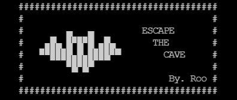

# Escape The Cave
## by. Ruairidh MacArthur

- [Live Site]()

- [Repo]()
# Table of Contents
1. [Intro](#intro)
2. [Technologies](#technologies)
3. [Bugs & Fixes](#bugs--fixes)
4. [Credits](#credits)
5. [Deployment](#deployment)

## Intro

A text based, turn based game that the user will operate in the command line. The aim of the game is to escape the cave without getting caught by your captures. This game is completely written in Python 

## Design

[Code Logic Flow Chart](https://lucid.app/lucidchart/invitations/accept/inv_45e4f3f7-722a-4413-a2d3-3a04dfd3cb2b)

Content

## Technologies

### Languages

- [Python](https://en.wikipedia.org/wiki/Python_(programming_language))

### Other Technologies and Libraries 

- [time](https://docs.python.org/3/library/time.html)
- [GitHub]()
- [Git]()
- [VS-Code]()
- [Heroku](https://heroku.com)

## Bugs & Fixes

1. The typing animation function works flawlessly in terminal but when pushing to heroku and running it through the terminal template provided the animation isn't showing. 

## Credits

1. [Code Institute Template](https://github.com/Code-Institute-Org/python-essentials-template)
    - The Template for the GUI for my python project was provided by Code Institute. This allows for the Command line to be shown and used within the browser.

## Deployment

This application will be deployed via [Heroku](https://heroku.com)

### Creating App.

1. Ensure all code is correct and ready to deployment. 
2. Enter the following code to import the required dependencies to the requirements.txt file:
    > pip3 freeze > requirements.txt
    - Heroku will use this file to import the dependencies that are required.
3. Log into or sign up to Heroku(it's free).
    - If signing up, you will need to wait and accept authentication email.
4. Navigate to Dashboard. 
5. Click "New" and select "create new app" from the drop down menu. This is found in the upper right portion of the window. 
6. Provide a name for your application, this needs to be unique, and select your region.
7. Click "Create App".

### Setting up Heroku App

1. Navigate to "Settings" and scroll down to "build packs".
2. Click "build packs" and then click both "python" and "node.js"(node.js is needed for the mock terminal.)
3. Ensure that the python buildpack is above the node.js buildpack, You can click and drag the packs to re-arrange them.

### App Deployment.

1. Navigate to the "Deploy" section.
2. Scroll down to "Deployment Method" and select "GitHub".
3. Authorize the connection of Heroku to GitHub.
4. Search for your GitHub repository name, and select the correct repository.
5. For Deployment there are two options, Automatic Deployments or Manual.
    - Automatic Deployment: This will prompt Heroku to re-build your app each time you push your code to GitHub.
    - Manual Deployment: This will only prompt Heroku to build your app when you manually tell it to do so. 
6. Ensure the correct branch is selected "master/Main", and select the deployment method that you desire. In this case I will be using Automatic Deployment.

### Forking Repository

If you wish to experiment with the code freely, you can achieve this by forking the repository. Forking a repository allows you to experiment without the original project being effected. To achieve this you need to:

1. Navigate to the repository roomacarthur/escape-the-cave.
2. In the top right of the page, below your profile you should see a "Fork" button. Simply click on this.
3. A copy of the repository will then be added to your own Repositories Page.

### Cloning Repository

1. Open GitBash ad create a directory where you want to save the code.
    
    > $ mkdir "directory-name"
2. Navigate into the new directory
    
    > $ cd "directory-name"
3. Navigate to the repository on GitHub [HERE](github.com/roomacarthur/escape-the-cave)
4. On the upper right hand side of the content, click on the button "Code"
5. A dropdown box should appear, copy the SHH key.
6. Open up your GitBash terminal from before. 
7. Clone the repository with the following command.
    
    > $ git clone "SSH-KEY"

The code will now be cloned into a local directory for you to access. You can now access the code in your IDE by entering the following code into your terminal:
    
    > $ code .